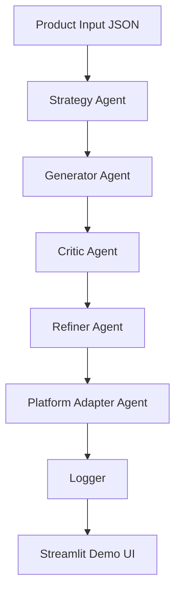

# Agentic Content Workflow

A multi-step LLM workflow for generating, critiquing, refining, and adapting product content across channels.
This project demonstrates how AI workflows can support growth and discovery work through structured content generation, critique, refinement, and channel adaptation. It is built as a lightweight prototype to simulate agent-style systems for messaging and distribution.


## Overview

This project explores how AI workflows can support growth, discovery, and distribution work. Instead of generating content in one step, the system uses multiple agent-style stages to transform product information into clearer, more trustworthy, and more platform-appropriate content.

The workflow is designed to simulate the kind of work involved in AI-native growth roles, where the goal is not just to write content, but to build repeatable systems that improve messaging quality over time.

This project is designed to support both live LLM API calls and a mock fallback mode for demo purposes. The fallback mode allows the workflow to run even when API quota or billing constraints are present, while still demonstrating workflow structure, prompt design, and iterative refinement.

## Why I Built This

I built this project to demonstrate how LLM-based workflows can be used for:
- product messaging
- content generation
- automated critique and revision
- cross-platform adaptation
- lightweight feedback loops

This project is especially inspired by roles focused on growth, discovery, and distribution for AI products.

## What the Workflow Does

The system takes a structured product input and runs it through several stages:

1. **Strategy Agent**  
   Identifies the target audience, user pain points, key message, and trust angles.

2. **Generator Agent**  
   Creates first-draft content for multiple channels.

3. **Critic Agent**  
   Reviews the draft for clarity, trustworthiness, specificity, empathy, and platform fit.

4. **Refiner Agent**  
   Revises the content using the critic’s feedback.

5. **Platform Adapter Agent**  
   Adapts the refined content into formats suitable for different channels.

6. **Logger**  
   Saves prompts, outputs, and workflow results for review.

## Workflow Diagram


## Example Use Case

This repo includes sample product inputs such as:
- an AI mental health companion
- an AI study support tool


For each product, the workflow can generate:
- landing page copy
- LinkedIn post
- X post
- FAQ snippet

It then critiques and refines the content to improve overall quality.

## Example Output

Below is an example of how the workflow transforms a product input through generation, critique, and refinement.

### Example Product

**CalmLoop**  
An AI mental health companion for young adults who feel lonely or anxious late at night.

### Draft Output


**Landing Page Copy**  
CalmLoop is an AI mental health companion that offers emotional support whenever you need it. It helps users feel less alone through multilingual conversations, gentle journaling prompts, and a calm, non-judgmental experience.

**LinkedIn Post**  
Many people struggle to find emotional support in the moments they need it most. CalmLoop is designed to offer multilingual, low-friction AI companionship for users seeking a private and supportive space to reflect, process emotions, and feel heard.

**X Post**  
Feeling anxious or alone late at night? CalmLoop offers multilingual AI support, gentle conversation, and journaling prompts in a calm, private space.

**FAQ Snippet**  
**Is CalmLoop a replacement for therapy?**  
No. CalmLoop is designed as a supportive companion and reflection tool, not a replacement for professional mental health care.

### Critic Feedback


**Scores**
- Clarity: 4/5
- Trustworthiness: 3/5
- Specificity: 3/5
- Empathy: 4/5
- Platform Fit: 4/5
- Spamminess: 4/5

**Strengths**
- Tone is calm and supportive
- Messaging is easy to understand
- FAQ already addresses an important trust concern

**Weaknesses**
- Product value is still somewhat generic
- Could more clearly explain when and why a user would use it
- Needs stronger trust framing for a sensitive product category

**Revision Instructions**
- Add more specific user context
- Increase trust and safety framing
- Make the value proposition less generic
- Keep the tone empathetic without sounding promotional

### Refined Output

**Landing Page Copy**  
CalmLoop is a multilingual AI companion designed for moments when emotional support feels hardest to access, especially late at night. It offers gentle conversation and guided reflection in a calm, low-pressure space, while making clear that it is not a substitute for professional care.

**LinkedIn Post**  
Emotional support is often hardest to access in the exact moments people need it most. CalmLoop is an AI companion designed for those late-night moments of loneliness or anxiety, offering multilingual, low-pressure support and guided reflection in a private, approachable format.

**X Post**  
Late-night anxiety can feel isolating. CalmLoop is a multilingual AI companion designed to offer gentle, low-pressure emotional support and reflection when it feels hardest to reach out.

**FAQ Snippet**  
**Is CalmLoop a replacement for therapy?**  
No. CalmLoop is designed to provide supportive conversation and reflection, but it does not replace licensed mental health care or crisis services.

## Why the Refinement Matters

The refinement stage improves the draft by making the message:
- more specific
- more trustworthy
- less generic
- better suited for a sensitive product category

This demonstrates how an agent-style workflow can go beyond one-shot generation and instead support iterative improvement through structured feedback.

## Project Structure

```text
agentic-content-workflow/
│
├── app.py
├── main.py
├── requirements.txt
├── README.md
├── .env.example
│
├── data/
│   └── sample_products.json
│
├── prompts/
│   ├── strategist.txt
│   ├── generator.txt
│   ├── critic.txt
│   ├── refiner.txt
│   └── adapter.txt
│
├── src/
│   ├── config.py
│   ├── llm.py
│   ├── schemas.py
│   ├── workflow.py
│   ├── logger.py
│   └── utils.py
│
└── artifacts/
    └── results.json
```
## Tech Stack

- Python
- OpenAI API
- Streamlit
- Pydantic
- python-dotenv

## Setup

### 1. Clone the repository

```bash
git clone https://github.com/tongwu45/agentic-content-workflow.git
cd agentic-content-workflow
```
### 2. Clone the repository
```bash
python -m venv .venv
source .venv/bin/activate
```
On Windows:
```bash
.venv\Scripts\activate
```
### 3. Install dependencies

```bash
pip install -r requirements.txt
```
### 4. Add environment variables
Copy the example file:
```bash
cp .env.example .env
```
Then add your OpenAI API key in .env:
```bash
OPENAI_API_KEY=your_api_key_here
OPENAI_MODEL=gpt-4.1-mini
```

## How to Run
### Run the command-line workflow
```bash
python main.py
```
### Run the Streamlit demo
```bash
streamlit run app.py
```
## Sample Input Format
```bash
{
  "product_name": "CalmLoop",
  "category": "AI mental health companion",
  "audience": "young adults who feel lonely or anxious late at night",
  "features": [
    "24/7 multilingual emotional support",
    "gentle journaling prompts",
    "non-judgmental conversation",
    "privacy-aware positioning"
  ],
  "tone": "calm, empathetic, trustworthy",
  "constraints": [
    "do not claim to replace therapy",
    "avoid overpromising clinical outcomes"
  ]
}
```

## Evaluation Criteria
The Critic Agent scores content using the following dimensions:

clarity

trustworthiness

specificity

empathy

platform fit

spamminess

These scores are used to guide refinement and simulate a lightweight feedback loop.

## What This Project Demonstrates
This project is meant to show:

workflow design for LLM-based systems
multi-step content generation and revision
agent-style task separation
structured prompt design
system thinking for growth and discovery work

It is not meant to be a production marketing system. Instead, it is a prototype that demonstrates how AI can support content and distribution workflows.

## Limitations
Uses sample product inputs instead of proprietary company data
Evaluation is model-based, not human-labeled
Does not include live traffic or conversion metrics
Does not yet measure real-world channel performance

## Future Improvements

Potential next steps include:

adding human evaluation
comparing multiple prompt strategies
testing how different product descriptions affect LLM recommendations
adding retrieval grounding for product facts
storing results in a database instead of a local JSON file
## Author

Built by Tong Wu as an exploration of AI workflows for growth, discovery, and distribution.

